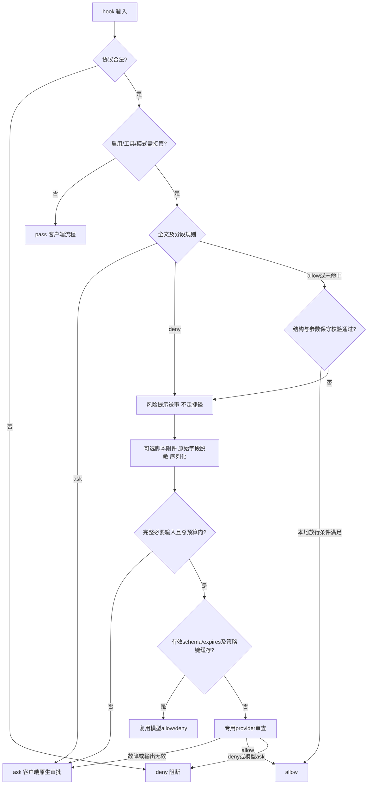

# 模块设计：决策管线（0.5.1）

## 决策顺序与不变量

下图表达安全约束，不要求内部函数逐行按图排列；任何自动 allow 前均须满足其适用的完整性和保守校验条件。

1. **接管边界**：关闭、范围外或明确非自动编辑模式 pass。当前模式闸门仅接受 `edit`，模式字段缺失保留兼容接管；不能据此声称 ask 跨所有模式生效。
2. **固定优先级**：`ask > deny（提示）> allow`，全文和复合段共同考虑；不能因先发现 deny 而遗漏其他 ask，也不能因宽泛 allow 提前返回。
3. **本地 allow 保守**：正则仅为候选，结构与参数另行校验。复合全文 allow 不直接生效，全部段可放行也须满足整体语法限制；未知参数与不能可靠识别的 shell 形式不走捷径。
4. **deny 规则不是拒绝**：携带 ruleHint 交模型，模型结合完整对象裁决。命中后不得被快速通道遮蔽。
5. **模型与故障区分**：模型 allow/deny；合法模型 ask 收敛为 deny。provider 故障、超限和必要输入不完整则 ask，不把失败当成模型拒绝或许可。

## 附件、脱敏与总预算

inspect_scripts 默认关闭。开启后尝试提取已知解释器/脚本引用，不能声称覆盖任意 shell 或模块加载行为。

- 仅 cwd 内普通文件，检查目录边界、符号链接和敏感路径组件；敏感目录中的普通文件也不能因文件名无敏感词而附加。
- script_max_bytes 限制单文件读取；附件数量另有限制。截断标记 `truncated` 不是允许模型基于部分内容放行的许可。
- 必要脚本读取失败、截断或其他原因导致完整审查对象不可得时，不能使用缓存或模型 allow 绕过完整性门槛，应转 ask。
- 对工具输入原始字段与附件内容脱敏后再序列化，避免转义、嵌套字段导致常见凭据漏检。
- max_payload_chars 是单一总预算：工具内容、cwd、规则提示、附件以及序列化格式开销均计入，不能再给附件追加独立预算。
- 超限不以截断工具 JSON 的方式继续申请自动许可，应转 ask。脱敏不是万能 secret 检测器，载荷仍需按不可信敏感数据处理。

## 缓存

稳定序列化工具名与输入，结合 cwd、附件摘要、危险规则/快速通道/提示词/渠道等策略摘要生成键。策略或脚本内容改变后不复用旧结论，不承诺旧键兼容。

缓存只承载模型 allow/deny，不存规则 ask、故障或人工授权。读取时检查 schema 与字段类型、合法决策、有限数值 expires、到期状态及适用期限。无 expires、非法类型、无效结构或过期条目不作为许可依据。TTL 由 cache_ttl_seconds 决定，0 禁用；写入使用原子写与并发保护。

缓存不能凌驾于本次规则和输入完整性检查之上。缓存命中的 deny 也需向主 agent 回传分析。

## 配置与控制 CLI

CLI 添加规则和加载端复用校验约束，包括动作、正则语法、数量和长度限制。危险规则整表超限不能只截取前半段，避免遗漏尾部确认规则；保守转人工并说明。快速通道超限停用捷径。CLI 拒绝无效/超限写入，写失败 exit 1，不宣称保存成功。provider 展示保护短 key，四项配置接口不变。

## 输出与失败分类

| 情况 | 结果 |
|------|------|
| 接管后 ask 规则 | ask 原生审批 |
| provider 未配置、超时、HTTP 错误、输出不可解析 | ask，并说明审查不可用 |
| 超限或必要内容不完整 | ask，不以截断内容自动允许 |
| 模型 deny / 模型存疑 ask | deny，并回传分析与替代方案 |
| 空 stdin、非法 JSON、缺工具名、非法工具输入等协议异常 | deny 阻断 |
| hook 进程崩溃 | exit 2 阻断 |
| 控制 CLI 写入失败 | exit 1 |

标准输出仅使用 hookSpecificOutput，不提供 simple 兼容开关。ask/deny 的 additionalContext 补充给主 agent；最终审批 UI 由客户端负责，无插件会话白名单。

## 信任边界与验证

不接收对话历史可以减小上下文污染，但工具说明、脚本与模型输出仍是不可信数据；不承诺注入免疫、完全脱敏或完整 shell 解析。离线执行 `npm test` 验证边界回归，不实际运行危险命令验收。
