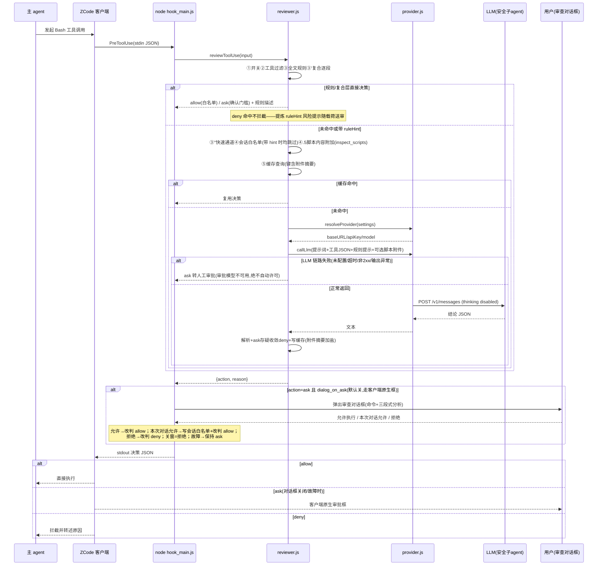
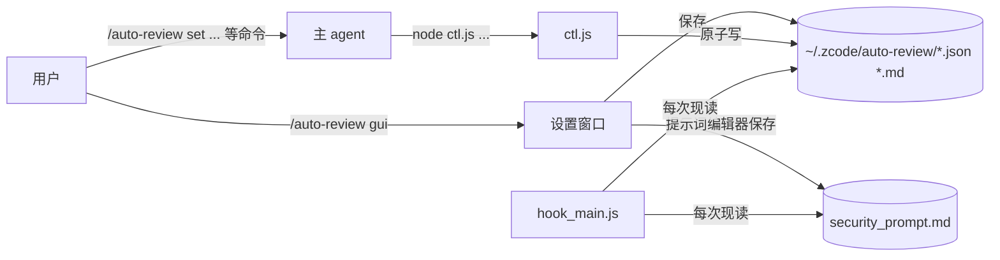
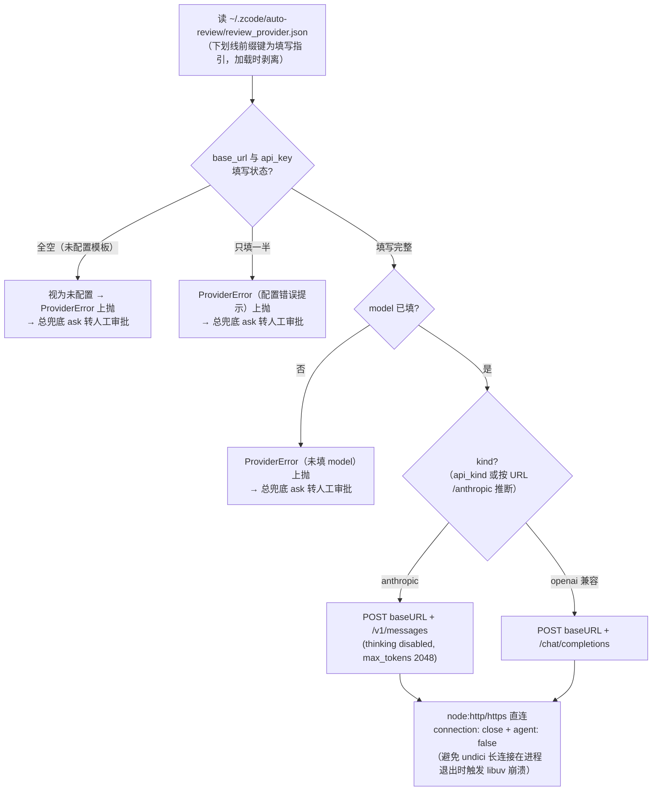

# 模块运行流程图

## 一次命令审查的完整时序（含对话框裁决）

## 用户改配置的路径

## 审批渠道解析（专用渠道，唯一 LLM 来源）

> 专用渠道是审批的唯一 LLM 来源，**不回落 ZCode provider 表**（主 agent 渠道多为需客户端签名的
> Coding Plan，直连必败 401/400）。未配置或不可用时错误上抛，由决策管线总兜底转人工审批（ask）——
> 模型不在场绝不自动许可，恢复后相同命令重新进入自动审查。
