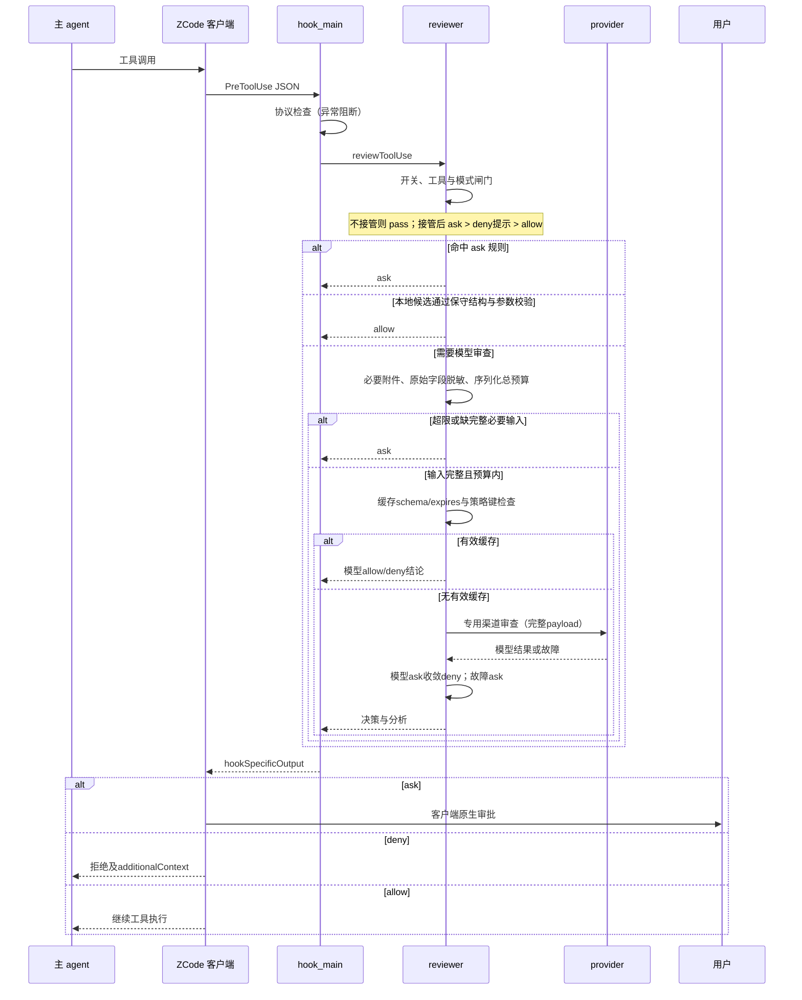
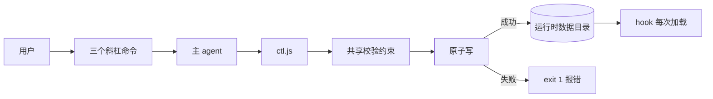
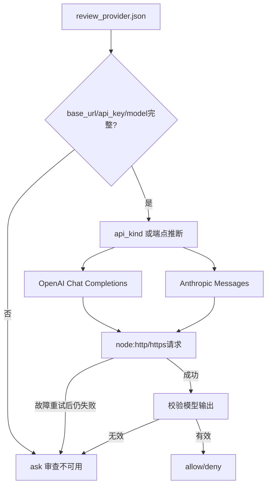

# 模块运行流程图（0.5.1）

## 一次审查

图中省略缓存写盘等内部步骤；必要输入不完整不能通过任何自动 allow 路径。模型结论缓存不是人工授权缓存，不含插件会话许可。

## 配置路径

提示词 edit 由主 agent 读取全文、经用户确认改写；provider 四项由用户填写，不交 set 管理。没有 GUI 写入分支。

## 专用审批渠道

渠道接口保留 base_url、api_key、api_kind、model，不回落客户端 provider 表。`provider test` 真实联网；项目 `npm test` 使用本地模拟服务离线验证。hook 总预算 2 分钟，无插件对话框等待分支。
